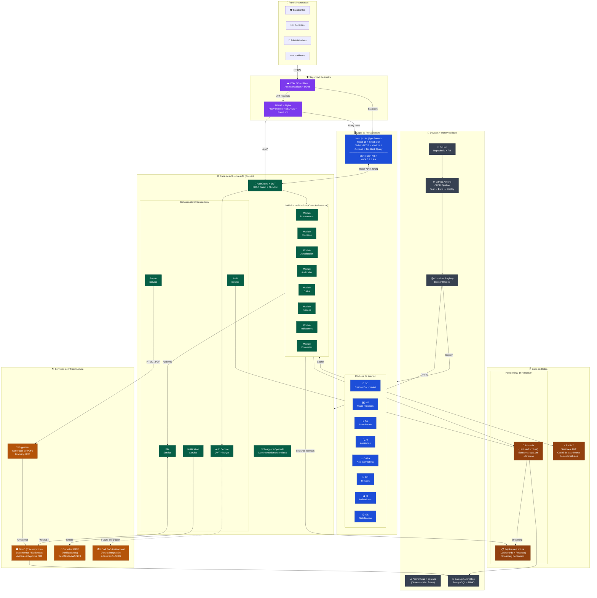

# SIGC-UNT — Diagramas de Arquitectura y Entidad-Relación
## Universidad Nacional de Trujillo | Sistema Integrado de Gestión de la Calidad

---

## ENTREGABLE 2: Diagrama de Arquitectura del Sistema



---

## ENTREGABLE 3: Diagrama Entidad-Relación Completo

> **Leyenda de colores:**
> - 🟩 **Verde** → Tablas de Catálogo/Lookup
> - 🟦 **Azul** → Tablas Maestras
> - 🟧 **Naranja** → Tablas de Transacción
> - ⬛ **Gris** → Tablas de Auditoría/Log

```mermaid
erDiagram
    %% ══════════════════════════════════════════════
    %% CATÁLOGOS (Tablas de referencia controlada)
    %% ══════════════════════════════════════════════

    roles {
        SMALLINT id PK
        VARCHAR codigo UK
        VARCHAR nombre
        SMALLINT nivel_jerarquia
        BOOLEAN esta_activo
    }

    estados_flujo {
        SMALLINT id PK
        VARCHAR modulo
        VARCHAR codigo
        VARCHAR nombre
        VARCHAR color_hex
        BOOLEAN es_final
        SMALLINT orden
    }

    tipos_documento {
        SMALLINT id PK
        VARCHAR codigo UK
        VARCHAR nombre
        VARCHAR prefijo
        BOOLEAN requiere_aprobacion
    }

    tipos_hallazgo {
        SMALLINT id PK
        VARCHAR codigo UK
        VARCHAR nombre
        SMALLINT severidad
    }

    niveles_riesgo {
        SMALLINT id PK
        VARCHAR codigo UK
        VARCHAR nombre
        DECIMAL rango_min
        DECIMAL rango_max
        VARCHAR color_hex
    }

    tipos_auditoria {
        SMALLINT id PK
        VARCHAR codigo UK
        VARCHAR nombre
    }

    tipos_pregunta {
        SMALLINT id PK
        VARCHAR codigo UK
        VARCHAR nombre
        BOOLEAN tiene_opciones
    }

    metodos_causa_raiz {
        SMALLINT id PK
        VARCHAR codigo UK
        VARCHAR nombre
    }

    estandares_acreditacion {
        SMALLINT id PK
        VARCHAR codigo UK
        VARCHAR nombre
        VARCHAR organismo
        VARCHAR version
    }

    frecuencias_medicion {
        SMALLINT id PK
        VARCHAR codigo UK
        VARCHAR nombre
        SMALLINT dias_periodo
    }

    %% ══════════════════════════════════════════════
    %% MAESTRAS - Entidades principales del negocio
    %% ══════════════════════════════════════════════

    facultades {
        UUID id PK
        VARCHAR codigo UK
        VARCHAR nombre
        BOOLEAN esta_activo
        TIMESTAMPTZ creado_en
    }

    areas {
        UUID id PK
        VARCHAR codigo UK
        VARCHAR nombre
        UUID facultad_id FK
        UUID area_padre_id FK
        VARCHAR tipo_area
        BOOLEAN esta_activo
        TIMESTAMPTZ creado_en
        TIMESTAMPTZ modificado_en
    }

    usuarios {
        UUID id PK
        VARCHAR codigo_usuario UK
        VARCHAR username UK
        VARCHAR email UK
        VARCHAR password_hash
        VARCHAR nombres
        VARCHAR apellidos
        VARCHAR tipo_usuario
        UUID area_id FK
        VARCHAR cargo
        BOOLEAN esta_activo
        TIMESTAMPTZ ultimo_login
        TIMESTAMPTZ eliminado_en
    }

    programas_academicos {
        UUID id PK
        VARCHAR codigo UK
        VARCHAR nombre
        VARCHAR nivel
        VARCHAR modalidad
        UUID facultad_id FK
        UUID area_id FK
        SMALLINT duracion_ciclos
        BOOLEAN esta_activo
    }

    objetivos_estrategicos {
        UUID id PK
        VARCHAR codigo UK
        VARCHAR nombre
        VARCHAR perspectiva
        SMALLINT anio_pei
        BOOLEAN esta_activo
    }

    %% ══════════════════════════════════════════════
    %% MÓDULO GD - GESTIÓN DOCUMENTAL
    %% ══════════════════════════════════════════════

    documentos {
        UUID id PK
        VARCHAR codigo UK
        SMALLINT tipo_documento_id FK
        VARCHAR titulo
        UUID area_id FK
        UUID proceso_id FK
        TEXT[] palabras_clave
        SMALLINT estado_id FK
        VARCHAR version_actual
        BOOLEAN esta_activo
        UUID creado_por FK
        TIMESTAMPTZ eliminado_en
    }

    versiones_documento {
        UUID id PK
        UUID documento_id FK
        VARCHAR numero_version
        VARCHAR contenido_url
        SMALLINT estado_id FK
        BOOLEAN es_version_actual
        UUID elaborado_por FK
        UUID revisado_por FK
        UUID aprobado_por FK
        TIMESTAMPTZ fecha_aprobacion
    }

    aprobaciones_documento {
        BIGINT id PK
        UUID version_id FK
        SMALLINT paso
        VARCHAR tipo_paso
        UUID usuario_id FK
        VARCHAR accion
        TEXT comentarios
        TIMESTAMPTZ fecha_accion
    }

    %% ══════════════════════════════════════════════
    %% MÓDULO MP - MAPA DE PROCESOS
    %% ══════════════════════════════════════════════

    macroprocesos {
        UUID id PK
        VARCHAR codigo UK
        VARCHAR nombre
        VARCHAR tipo
        SMALLINT orden
        BOOLEAN esta_activo
    }

    procesos {
        UUID id PK
        UUID macroproceso_id FK
        VARCHAR codigo UK
        VARCHAR nombre
        UUID area_responsable_id FK
        SMALLINT estado_id FK
        VARCHAR diagrama_bpmn_url
        BOOLEAN esta_activo
    }

    subprocesos {
        UUID id PK
        UUID proceso_id FK
        VARCHAR codigo UK
        VARCHAR nombre
        UUID responsable_id FK
        SMALLINT orden
        BOOLEAN esta_activo
    }

    matriz_raci {
        BIGINT id PK
        UUID proceso_id FK
        UUID subproceso_id FK
        UUID area_id FK
        UUID usuario_id FK
        CHAR rol_raci
    }

    %% ══════════════════════════════════════════════
    %% MÓDULO IG - INDICADORES
    %% ══════════════════════════════════════════════

    indicadores {
        UUID id PK
        VARCHAR codigo UK
        VARCHAR nombre
        TEXT formula
        VARCHAR unidad_medida
        VARCHAR tipo_tendencia
        DECIMAL meta_valor
        SMALLINT frecuencia_id FK
        UUID proceso_id FK
        UUID area_responsable_id FK
        UUID responsable_id FK
        UUID objetivo_estrategico_id FK
        BOOLEAN esta_activo
    }

    mediciones_indicador {
        BIGINT id PK
        UUID indicador_id FK
        DATE periodo_inicio
        DATE periodo_fin
        DECIMAL valor_real
        DECIMAL valor_meta
        VARCHAR estado_semaforo
        UUID registrado_por FK
        UUID validado_por FK
        TIMESTAMPTZ fecha_registro
    }

    %% ══════════════════════════════════════════════
    %% MÓDULO AA - ACREDITACIÓN
    %% ══════════════════════════════════════════════

    procesos_acreditacion {
        UUID id PK
        UUID programa_id FK
        SMALLINT estandar_id FK
        VARCHAR tipo_proceso
        SMALLINT anio_inicio
        DATE fecha_vencimiento
        SMALLINT estado_id FK
        DECIMAL puntuacion_total
    }

    factores_estandar {
        UUID id PK
        SMALLINT estandar_id FK
        VARCHAR codigo
        VARCHAR nombre
        DECIMAL ponderacion
    }

    criterios_factor {
        UUID id PK
        UUID factor_id FK
        VARCHAR codigo
        VARCHAR nombre
        DECIMAL ponderacion
    }

    autoevaluaciones {
        UUID id PK
        UUID proceso_acreditacion_id FK
        UUID criterio_id FK
        DECIMAL puntuacion
        VARCHAR nivel_logro
        TEXT fortalezas
        TEXT debilidades
        TEXT plan_mejora
        UUID responsable_id FK
        SMALLINT estado_id FK
    }

    evidencias {
        UUID id PK
        VARCHAR entidad_tipo
        UUID entidad_id
        VARCHAR nombre
        VARCHAR archivo_url
        VARCHAR tipo_mime
        UUID subido_por FK
        TIMESTAMPTZ creado_en
    }

    %% ══════════════════════════════════════════════
    %% MÓDULO AI - AUDITORÍAS
    %% ══════════════════════════════════════════════

    planes_auditoria {
        UUID id PK
        SMALLINT anio
        VARCHAR nombre
        UUID area_responsable_id FK
        SMALLINT estado_id FK
        DATE fecha_aprobacion
        UUID aprobado_por FK
    }

    auditorias {
        UUID id PK
        UUID plan_id FK
        SMALLINT tipo_id FK
        VARCHAR codigo UK
        VARCHAR nombre
        UUID area_auditada_id FK
        UUID proceso_auditado_id FK
        DATE fecha_programada_inicio
        DATE fecha_programada_fin
        SMALLINT estado_id FK
        VARCHAR informe_url
    }

    auditores_asignados {
        BIGINT id PK
        UUID auditoria_id FK
        UUID usuario_id FK
        VARCHAR rol_auditoria
    }

    checklists {
        UUID id PK
        SMALLINT tipo_auditoria_id FK
        VARCHAR nombre
        VARCHAR version
        BOOLEAN esta_activo
    }

    items_checklist {
        UUID id PK
        UUID checklist_id FK
        TEXT pregunta
        VARCHAR tipo_respuesta
        BOOLEAN obligatorio
        SMALLINT orden
    }

    respuestas_checklist {
        UUID id PK
        UUID auditoria_id FK
        UUID item_id FK
        VARCHAR respuesta
        TEXT observacion
        BOOLEAN genera_hallazgo
        UUID respondido_por FK
    }

    hallazgos {
        UUID id PK
        UUID auditoria_id FK
        SMALLINT tipo_id FK
        VARCHAR codigo
        TEXT descripcion
        UUID proceso_id FK
        UUID area_id FK
        SMALLINT estado_id FK
        DATE fecha_deteccion
        DATE fecha_limite_cierre
        UUID cerrado_por FK
    }

    %% ══════════════════════════════════════════════
    %% MÓDULO CAPA
    %% ══════════════════════════════════════════════

    no_conformidades {
        UUID id PK
        VARCHAR codigo UK
        VARCHAR origen
        UUID hallazgo_id FK
        TEXT descripcion
        UUID proceso_id FK
        UUID area_id FK
        UUID detectado_por FK
        SMALLINT estado_id FK
        DATE fecha_deteccion
        UUID creado_por FK
    }

    analisis_causa_raiz {
        UUID id PK
        UUID nc_id FK
        SMALLINT metodo_id FK
        TEXT descripcion_causa
        TEXT causa_raiz
        UUID analista_id FK
        DATE fecha_analisis
        JSONB datos_metodo
    }

    acciones_capa {
        UUID id PK
        UUID nc_id FK
        VARCHAR tipo_accion
        TEXT descripcion
        UUID responsable_id FK
        UUID area_id FK
        DATE fecha_compromiso
        DATE fecha_real_cierre
        SMALLINT porcentaje_avance
        SMALLINT estado_id FK
        UUID verificado_por FK
    }

    %% ══════════════════════════════════════════════
    %% MÓDULO GR - RIESGOS
    %% ══════════════════════════════════════════════

    riesgos {
        UUID id PK
        VARCHAR codigo UK
        VARCHAR nombre
        VARCHAR tipo_riesgo
        UUID area_id FK
        UUID proceso_id FK
        UUID objetivo_estrategico_id FK
        DECIMAL probabilidad
        DECIMAL impacto
        DECIMAL puntuacion
        SMALLINT nivel_riesgo_id FK
        UUID responsable_id FK
        SMALLINT estado_id FK
        BOOLEAN activo
    }

    planes_mitigacion {
        UUID id PK
        UUID riesgo_id FK
        VARCHAR tipo_respuesta
        TEXT descripcion
        UUID responsable_id FK
        DATE fecha_inicio
        DATE fecha_fin
        SMALLINT estado_id FK
    }

    seguimientos_riesgo {
        BIGINT id PK
        UUID riesgo_id FK
        DATE fecha_seguimiento
        DECIMAL probabilidad_actual
        DECIMAL impacto_actual
        VARCHAR estado_control
        UUID registrado_por FK
    }

    %% ══════════════════════════════════════════════
    %% MÓDULO GS - SATISFACCIÓN / ENCUESTAS
    %% ══════════════════════════════════════════════

    encuestas {
        UUID id PK
        VARCHAR codigo UK
        VARCHAR titulo
        VARCHAR poblacion_objetivo
        UUID programa_id FK
        UUID area_id FK
        VARCHAR ciclo_academico
        TIMESTAMPTZ fecha_inicio
        TIMESTAMPTZ fecha_fin
        SMALLINT estado_id FK
        BOOLEAN es_anonima
        UUID creado_por FK
    }

    secciones_encuesta {
        UUID id PK
        UUID encuesta_id FK
        VARCHAR titulo
        SMALLINT orden
    }

    preguntas_encuesta {
        UUID id PK
        UUID seccion_id FK
        SMALLINT tipo_id FK
        TEXT texto
        BOOLEAN obligatoria
        SMALLINT orden
        JSONB configuracion
    }

    opciones_pregunta {
        BIGINT id PK
        UUID pregunta_id FK
        VARCHAR texto
        VARCHAR valor
        SMALLINT orden
    }

    participaciones_encuesta {
        UUID id PK
        UUID encuesta_id FK
        UUID usuario_id FK
        VARCHAR token_anonimo
        TIMESTAMPTZ fecha_inicio
        BOOLEAN completada
    }

    respuestas_encuesta {
        BIGINT id PK
        UUID participacion_id FK
        UUID pregunta_id FK
        TEXT valor_texto
        DECIMAL valor_numerico
        JSONB opciones_seleccionadas
    }

    %% ══════════════════════════════════════════════
    %% SEGURIDAD Y SESIONES
    %% ══════════════════════════════════════════════

    usuarios_roles {
        BIGINT id PK
        UUID usuario_id FK
        SMALLINT rol_id FK
        UUID area_id FK
        DATE fecha_inicio
        DATE fecha_fin
    }

    tokens_refresco {
        BIGINT id PK
        UUID usuario_id FK
        VARCHAR token_hash UK
        TIMESTAMPTZ expira_en
        BOOLEAN revocado
    }

    %% ══════════════════════════════════════════════
    %% AUDITORÍA Y LOGS
    %% ══════════════════════════════════════════════

    log_auditoria_sistema {
        BIGINT id PK
        UUID usuario_id FK
        VARCHAR accion
        VARCHAR entidad
        TEXT entidad_id
        JSONB datos_anteriores
        JSONB datos_nuevos
        INET ip_origen
        TIMESTAMPTZ creado_en
    }

    log_sesiones {
        BIGINT id PK
        UUID usuario_id FK
        VARCHAR tipo_evento
        INET ip_origen
        INTEGER duracion_minutos
        TIMESTAMPTZ creado_en
    }

    notificaciones {
        BIGINT id PK
        UUID usuario_id FK
        VARCHAR tipo
        VARCHAR titulo
        TEXT mensaje
        BOOLEAN leida
        TIMESTAMPTZ creado_en
    }

    %% ══════════════════════════════════════════════
    %% RELACIONES
    %% ══════════════════════════════════════════════

    %% Estructura organizacional
    facultades ||--o{ areas : "contiene"
    areas ||--o{ areas : "tiene sub-áreas"
    areas ||--o{ usuarios : "pertenece"
    areas ||--o{ programas_academicos : "gestiona"
    facultades ||--o{ programas_academicos : "ofrece"

    %% Usuarios y roles
    usuarios ||--o{ usuarios_roles : "tiene"
    roles ||--o{ usuarios_roles : "asignado a"
    areas ||--o{ usuarios_roles : "con alcance en"
    usuarios ||--o{ tokens_refresco : "genera"

    %% Módulo GD
    tipos_documento ||--o{ documentos : "clasifica"
    areas ||--o{ documentos : "posee"
    estados_flujo ||--o{ documentos : "estado actual"
    usuarios ||--o{ documentos : "crea"
    procesos ||--o{ documentos : "referencia"
    documentos ||--o{ versiones_documento : "tiene"
    estados_flujo ||--o{ versiones_documento : "estado"
    usuarios ||--o{ versiones_documento : "elabora"
    versiones_documento ||--o{ aprobaciones_documento : "sigue flujo"
    usuarios ||--o{ aprobaciones_documento : "aprueba"

    %% Módulo MP
    macroprocesos ||--o{ procesos : "agrupa"
    areas ||--o{ procesos : "es responsable de"
    estados_flujo ||--o{ procesos : "estado"
    procesos ||--o{ subprocesos : "descompone en"
    usuarios ||--o{ subprocesos : "es responsable de"
    procesos ||--o{ matriz_raci : "define"
    subprocesos ||--o{ matriz_raci : "define"
    areas ||--o{ matriz_raci : "participa en"
    usuarios ||--o{ matriz_raci : "asignado en"

    %% Módulo IG
    frecuencias_medicion ||--o{ indicadores : "tiene"
    procesos ||--o{ indicadores : "mide"
    areas ||--o{ indicadores : "reporta"
    usuarios ||--o{ indicadores : "es responsable de"
    objetivos_estrategicos ||--o{ indicadores : "alineado a"
    indicadores ||--o{ mediciones_indicador : "registra"
    usuarios ||--o{ mediciones_indicador : "registra"

    %% Módulo AA
    programas_academicos ||--o{ procesos_acreditacion : "tiene"
    estandares_acreditacion ||--o{ procesos_acreditacion : "usa"
    estados_flujo ||--o{ procesos_acreditacion : "estado"
    estandares_acreditacion ||--o{ factores_estandar : "estructura"
    factores_estandar ||--o{ criterios_factor : "compone"
    procesos_acreditacion ||--o{ autoevaluaciones : "contiene"
    criterios_factor ||--o{ autoevaluaciones : "evalúa"
    usuarios ||--o{ autoevaluaciones : "es responsable de"
    estados_flujo ||--o{ autoevaluaciones : "estado"
    usuarios ||--o{ evidencias : "sube"

    %% Módulo AI
    areas ||--o{ planes_auditoria : "gestiona"
    estados_flujo ||--o{ planes_auditoria : "estado"
    planes_auditoria ||--o{ auditorias : "contiene"
    tipos_auditoria ||--o{ auditorias : "clasifica"
    areas ||--o{ auditorias : "es auditada"
    procesos ||--o{ auditorias : "alcance"
    estados_flujo ||--o{ auditorias : "estado"
    auditorias ||--o{ auditores_asignados : "tiene equipo"
    usuarios ||--o{ auditores_asignados : "asignado como"
    tipos_auditoria ||--o{ checklists : "tiene plantilla"
    checklists ||--o{ items_checklist : "tiene ítems"
    auditorias ||--o{ respuestas_checklist : "responde"
    items_checklist ||--o{ respuestas_checklist : "respondido"
    usuarios ||--o{ respuestas_checklist : "responde"
    auditorias ||--o{ hallazgos : "genera"
    tipos_hallazgo ||--o{ hallazgos : "clasifica"
    procesos ||--o{ hallazgos : "afecta"
    areas ||--o{ hallazgos : "detectado en"
    estados_flujo ||--o{ hallazgos : "estado"

    %% Módulo CAPA
    hallazgos ||--o{ no_conformidades : "origina"
    areas ||--o{ no_conformidades : "pertenece a"
    procesos ||--o{ no_conformidades : "afecta"
    estados_flujo ||--o{ no_conformidades : "estado"
    no_conformidades ||--o{ analisis_causa_raiz : "analiza"
    metodos_causa_raiz ||--o{ analisis_causa_raiz : "usa método"
    usuarios ||--o{ analisis_causa_raiz : "realiza"
    no_conformidades ||--o{ acciones_capa : "genera"
    usuarios ||--o{ acciones_capa : "es responsable de"
    areas ||--o{ acciones_capa : "pertenece a"
    estados_flujo ||--o{ acciones_capa : "estado"

    %% Módulo GR
    areas ||--o{ riesgos : "tiene"
    procesos ||--o{ riesgos : "tiene"
    objetivos_estrategicos ||--o{ riesgos : "afecta a"
    niveles_riesgo ||--o{ riesgos : "clasifica"
    usuarios ||--o{ riesgos : "es responsable de"
    estados_flujo ||--o{ riesgos : "estado"
    riesgos ||--o{ planes_mitigacion : "tiene"
    usuarios ||--o{ planes_mitigacion : "es responsable de"
    estados_flujo ||--o{ planes_mitigacion : "estado"
    riesgos ||--o{ seguimientos_riesgo : "monitoreado en"
    usuarios ||--o{ seguimientos_riesgo : "registra"

    %% Módulo GS
    programas_academicos ||--o{ encuestas : "pertenece a"
    areas ||--o{ encuestas : "gestiona"
    estados_flujo ||--o{ encuestas : "estado"
    encuestas ||--o{ secciones_encuesta : "organiza"
    secciones_encuesta ||--o{ preguntas_encuesta : "contiene"
    tipos_pregunta ||--o{ preguntas_encuesta : "tipo"
    preguntas_encuesta ||--o{ opciones_pregunta : "tiene opciones"
    encuestas ||--o{ participaciones_encuesta : "recibe"
    usuarios ||--o{ participaciones_encuesta : "participa"
    participaciones_encuesta ||--o{ respuestas_encuesta : "registra"
    preguntas_encuesta ||--o{ respuestas_encuesta : "responde"

    %% Logs y notificaciones
    usuarios ||--o{ log_auditoria_sistema : "genera eventos"
    usuarios ||--o{ log_sesiones : "registra acceso"
    usuarios ||--o{ notificaciones : "recibe"
```

---

## ENTREGABLE 4: Especificación de API (Endpoints Principales)

### Convenciones Generales

- **Base URL**: `https://sigc.unitru.edu.pe/api/v1`
- **Autenticación**: `Authorization: Bearer <access_token>` en todas las rutas (salvo `/auth/*`)
- **Content-Type**: `application/json`
- **Paginación**: `?page=1&limit=20&sortBy=creado_en&order=DESC`
- **Respuestas de error**: `{ "statusCode": 4XX, "error": "string", "message": "string | string[]" }`

---

### Módulo Auth

```
POST   /auth/login
POST   /auth/logout
POST   /auth/refresh
POST   /auth/cambiar-password
GET    /auth/perfil
```

**POST /auth/login**
```json
Request:  { "username": "jperez", "password": "Mi@Pass2025" }
Response: {
  "access_token": "eyJhbGci...",
  "refresh_token": "eyJhbGci...",
  "expira_en": 900,
  "usuario": { "id": "uuid", "nombres": "Juan", "apellidos": "Pérez", "roles": ["JEFE_AREA"] }
}
```

---

### Módulo GD — Gestión Documental

```
GET    /documentos                    → Lista paginada con filtros (tipo, area, estado, palabras_clave)
POST   /documentos                    → Crear nuevo documento (estado inicial: BORRADOR)
GET    /documentos/:id                → Detalle con versión actual
PUT    /documentos/:id                → Actualizar metadatos
DELETE /documentos/:id                → Soft delete (requiere rol ADMIN_CALIDAD)

GET    /documentos/:id/versiones      → Lista de versiones
POST   /documentos/:id/versiones      → Crear nueva versión (sube archivo a MinIO)
POST   /documentos/:id/aprobar        → Enviar al siguiente paso del flujo
GET    /documentos/buscar?q=texto     → Búsqueda full-text con pg_trgm
```

**POST /documentos**
```json
Request: {
  "codigo": "POL-GD-003",
  "tipo_documento_id": 1,
  "titulo": "Política de Control Documental",
  "area_id": "uuid-area",
  "palabras_clave": ["documentos", "calidad", "control"]
}
Response: {
  "id": "uuid-doc",
  "codigo": "POL-GD-003",
  "estado": "BORRADOR",
  "creado_en": "2025-03-15T10:30:00Z"
}
```

---

### Módulo AI — Auditorías

```
GET    /auditorias/planes             → Planes anuales
POST   /auditorias/planes             → Crear plan anual
GET    /auditorias                    → Lista de auditorías (filtro: plan, area, estado, tipo)
POST   /auditorias                    → Programar auditoría
GET    /auditorias/:id                → Detalle con equipo y hallazgos
PATCH  /auditorias/:id/estado         → Cambiar estado (PROGRAMADA→EN_EJECUCION→FINALIZADA)
POST   /auditorias/:id/hallazgos      → Registrar hallazgo
GET    /auditorias/:id/hallazgos      → Lista de hallazgos de la auditoría
POST   /auditorias/:id/checklist      → Responder checklist
GET    /auditorias/hallazgos/abiertos → Hallazgos sin cerrar (para dashboard)
```

---

### Módulo CAPA

```
GET    /capa/no-conformidades         → Lista con filtros (origen, area, estado, fechas)
POST   /capa/no-conformidades         → Registrar NC
GET    /capa/no-conformidades/:id     → Detalle completo (análisis + acciones)
POST   /capa/no-conformidades/:id/analisis    → Registrar análisis de causa raíz
POST   /capa/no-conformidades/:id/acciones    → Crear acción CAPA
PUT    /capa/acciones/:id             → Actualizar acción (avance, evidencias)
PATCH  /capa/acciones/:id/verificar   → Registrar verificación de efectividad
GET    /capa/alertas/vencidos         → Acciones vencidas (para semáforo dashboard)
```

---

### Módulo IG — Indicadores y Dashboards

```
GET    /indicadores                   → Lista con filtros (area, proceso, objetivo)
POST   /indicadores                   → Crear indicador
GET    /indicadores/:id/mediciones    → Historial de mediciones paginado
POST   /indicadores/:id/mediciones    → Registrar nueva medición (trigger calcula semáforo)
GET    /dashboards/ejecutivo          → KPIs estratégicos (usa fn_dashboard_ejecutivo)
GET    /dashboards/procesos           → Indicadores por macroproceso
GET    /dashboards/acreditacion       → Estado de acreditación por programa
GET    /reportes/indicadores/exportar → PDF/Excel de indicadores por período
```

---

### Módulo GR — Riesgos

```
GET    /riesgos                       → Matriz de riesgos con filtros
POST   /riesgos                       → Registrar riesgo
GET    /riesgos/:id                   → Detalle con mitigaciones y seguimientos
POST   /riesgos/:id/mitigaciones      → Crear plan de mitigación
POST   /riesgos/:id/seguimientos      → Registrar seguimiento periódico
GET    /riesgos/mapa-calor            → Datos agregados P×I para heatmap
```

---

### Módulo GS — Encuestas

```
GET    /encuestas                     → Lista de encuestas (filtros: población, estado, ciclo)
POST   /encuestas                     → Crear encuesta
GET    /encuestas/:id                 → Detalle con secciones y preguntas
POST   /encuestas/:id/publicar        → Activar encuesta (estado DISENO→ACTIVA)
GET    /encuestas/:id/token           → Obtener token de participación anónimo
POST   /encuestas/:id/responder       → Enviar respuestas (upsert por participación)
GET    /encuestas/:id/resultados      → Estadísticas agregadas (solo rol ADMIN o JEFE)
GET    /encuestas/:id/exportar        → Exportar resultados como PDF/Excel
```

---

### Módulo AA — Acreditación

```
GET    /acreditacion/programas        → Estado de acreditación por programa
POST   /acreditacion/procesos         → Iniciar proceso de acreditación
GET    /acreditacion/procesos/:id     → Estado con factores, criterios y autoevaluaciones
POST   /acreditacion/procesos/:id/autoevaluacion/:criterio_id  → Registrar autoevaluación
POST   /evidencias                    → Subir evidencia (multipart/form-data → MinIO)
GET    /evidencias/:entidad_tipo/:entidad_id → Listar evidencias de una entidad
```

---

## Notas de Diseño y Decisiones Arquitectónicas

### 1. Tabla polimórfica `evidencias`
Se eligió una tabla única de evidencias con campo discriminador `entidad_tipo` en lugar de 5 tablas separadas (`evidencias_auditoria`, `evidencias_capa`, etc.).
**Ventajas**: Una sola API de carga de archivos, una sola lógica de MinIO, facilita búsqueda transversal de evidencias.
**Desventaja**: No hay FK referencial (solo integridad a nivel aplicación). Se mitiga con un CHECK constraint en `entidad_tipo` y validación en el servicio.

### 2. Particionamiento del log de auditoría
La tabla `log_auditoria_sistema` está particionada por rango de fecha (anual). Para una universidad que procesa miles de operaciones diarias, los logs crecen rápidamente.
**Ventaja**: Consultas históricas eficientes, posibilidad de archivar particiones antiguas sin afectar rendimiento.

### 3. Campo `puntuacion` generado en `riesgos`
Se usa `GENERATED ALWAYS AS (probabilidad * impacto) STORED` para que el motor de base de datos siempre mantenga la consistencia P×I. Evita errores en capa de aplicación y permite indexar la columna directamente.

### 4. JSONB para datos flexibles
- `datos_metodo` en `analisis_causa_raiz`: La estructura de un Ishikawa (ramas + causas) difiere de la de 5 Porqués (cadena). JSONB permite almacenar ambos sin romper el esquema.
- `configuracion` en `preguntas_encuesta`: Rangos de escala, etiquetas Likert, etc., varían por tipo de pregunta. JSONB evita 3+ tablas adicionales de configuración.
- `opciones_seleccionadas` en `respuestas_encuesta`: Array de IDs seleccionados en respuestas múltiples.

### 5. Soft deletes selectivos
Solo en tablas donde la eliminación tiene implicaciones legales o de auditoría: `usuarios`, `documentos`. Las demás usan `esta_activo = FALSE` o eliminación real con FK `ON DELETE CASCADE` donde es seguro.

### 6. Índices parciales
Se usan índices parciales con `WHERE` clause para mantenerlos pequeños y eficientes:
- `idx_usuarios_email WHERE eliminado_en IS NULL` → Solo usuarios activos
- `idx_hallazgos_estado WHERE fecha_cierre_real IS NULL` → Solo hallazgos pendientes
- `idx_notificaciones_usuario_leida WHERE leida = FALSE` → Solo no leídas

### 7. Preparación para integración con SIA/Moodle/SUNEDU
- Campo `ldap_dn` en `usuarios` para SSO futuro
- Tabla `programas_academicos` con campo `resolucion_creacion` y `estado_licenciamiento` para cruce con SUNEDU
- Ciclo académico en `encuestas` alineado al formato del SIA institucional
- UUIDs como PKs en entidades maestras facilitan sincronización con APIs externas sin colisión de IDs
```
